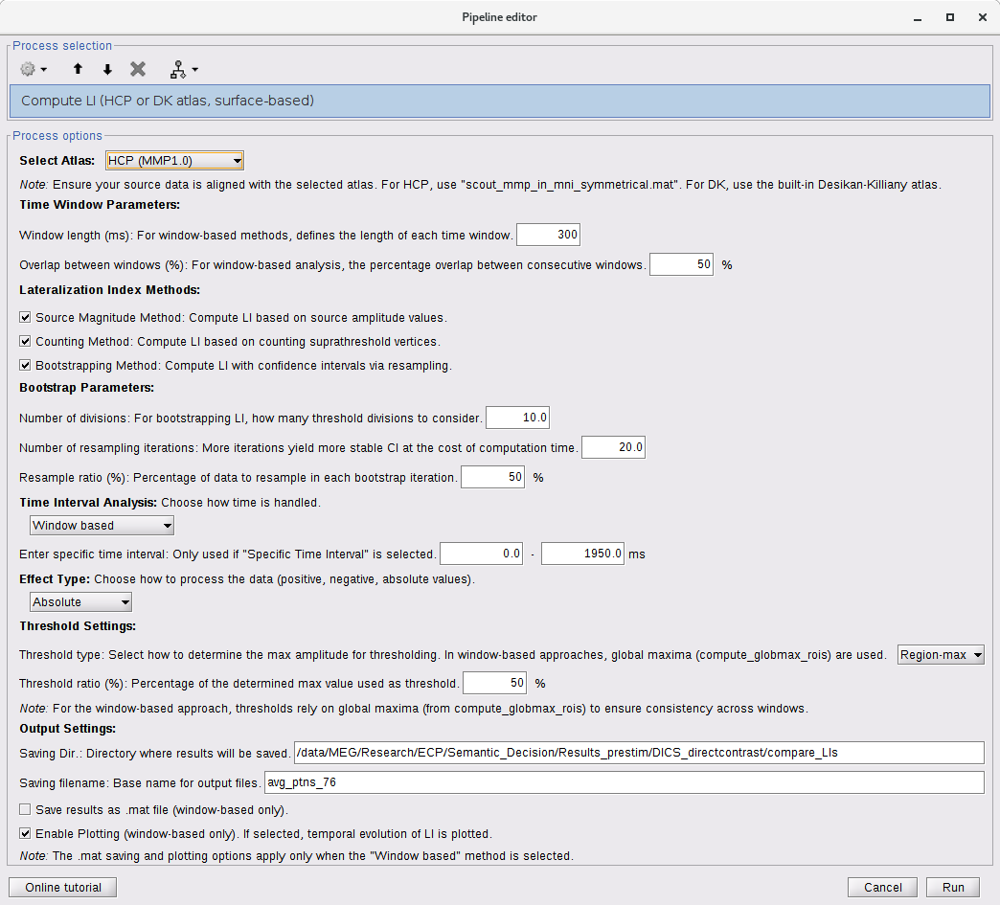

# MEG Laterality for Brainstorm

This repository hosts a Brainstorm-compatible pipeline for analyzing brain laterality using magnetoencephalography (MEG) task responses. The pipeline leverages [Brainstorm](https://neuroimage.usc.edu/brainstorm/), a popular MATLAB toolbox, to facilitate robust analysis of hemispheric differences and lateralization indices (LI) in brain activity.



*Figure 1: Example interface of the LI computation process in Brainstorm, showing the options for time intervals, LI methods, thresholding, and output preferences.*

## LI methods

The pipeline provides several methods for computing a Lateralization Index (LI):

- **Source Magnitude Method**: Compares source amplitude across hemispheres.
- **Counting Method**: Counts the number of suprathreshold vertices in left vs. right hemispheres.
- **Bootstrapping Method**: Uses resampling to obtain LI confidence intervals (95% CI), providing estimates of uncertainty around the LI measurement.

## Time intervals

You can also select different time intervals for analysis:
- **Specific Time Interval**: Analyze a predefined time range.
- **Averaged Time Interval**: Compute average activity across a chosen time segment.
- **Window-based Analysis**: Segment data into overlapping or non-overlapping windows, computing LI for each segment to capture temporal evolution of lateralization.

## Atlas (ROIs)

This pipeline currently supports the **Human Connectome Project (HCP) MMP1.0 atlas** and the **Desikan-Killiany (DK) atlas** for defining Regions of Interest (ROIs). Both atlases are well-established, yet they differ in granularity and anatomical resolution. The choice of atlas depends on your research needs:

- **HCP MMP1.0 Atlas** (High-Resolution, MNI Space):  
  A multimodal, high-resolution cortical parcellation aligned to symmetrical MNI space. It offers a fine-grained approach to assessing hemispheric dominance, with numerous ROIs grouped into categories (e.g., Angular, Frontal, Temporal, Lateral).  
  For more details, see [Glasser et al. (2016), *Nature*](https://www.nature.com/articles/nature18933).

- **Desikan-Killiany (DK) Atlas** (Lower-Resolution, Works in Individual or MNI Space):  
  A widely used cortical parcellation providing fewer, more anatomically coarse ROIs. This is beneficial if you prefer more general regional definitions (e.g., AngSmg, Front, LatFront, LatTemp, PeriSyl, Tanaka, Temp, Whole).  
  Using the DK atlas can simplify ROI selection and may be more accessible for initial or broad-level analyses.

### HCP Atlas (MNI space only)
- **Description**: Utilizes the HCP MMP1.0 multimodal atlas aligned to a symmetrical MNI template. 
- **ROIs**: Bilateral ROIs are grouped into 4 functional categories (e.g., Angular, Frontal, Temporal, Lateral).

**Steps:**
1. **Co-Registration**: Ensure your subject’s anatomy is co-registered or projected onto the default Brainstorm anatomy (in MNI space).
2. **Loading the Atlas**: In Brainstorm’s Scout panel, load the HCP atlas. Once loaded, these ROIs can be directly used by the pipeline.
3. **ROI Configuration**: The pipeline functions (`defineROIs_HCP`, `convertHCPScout`) can be configured to use HCP-based ROI groups.

### Desikan-Killiany (DK) Atlas (Individual/Native or MNI/Default space)
The **DK atlas** is a commonly used, lower-resolution cortical parcellation. It is ideal for analyses that require fewer, more anatomically coarse regions.

- **ROIs**: The DK-based ROIs are grouped into categories like AngSmg, Front, LatFront, LatTemp, PeriSyl, Tanaka, Temp, and Whole.
- **ROI Configuration**: The pipeline functions (`defineROIs_DK`, `convertDesikanKillianyScout`) can be configured to use DK-based ROI groups.

### User-Defined or Other Atlases
You can adapt the pipeline to other atlases by:

- **Conversion Functions**: Creating new conversion functions (e.g., `convertMyAtlasScout`) to ensure all expected regions are present.
- **ROI Grouping**: Defining ROI grouping functions (e.g., `defineROIs_MyAtlas`) to organize ROIs into meaningful hemispheric pairs or functional groups.

## Thresholding Mechanism

Thresholding plays a crucial role in determining which brain regions are active and contributes to the calculation of LI. The pipeline provides three threshold types:

- **Global-max**: The threshold is set based on the maximum amplitude observed across all time points and all regions.
- **Time-max**: The threshold is based on the maximum amplitude during a specific time of interest across all regions.
- **Region-max**: The threshold is determined by the maximum amplitude within each region of interest during the time of interest.

Users can adjust the threshold ratio to control the sensitivity of region inclusion in the LI calculation. This ratio is applied to the determined maximum value according to the selected threshold type.

## Prerequisites

- **MATLAB**: Tested on MATLAB version 2024.
- **Brainstorm**: Download and install from [the official website](https://neuroimage.usc.edu/brainstorm). Ensure Brainstorm is on your MATLAB path.
- **MEG Data**: Source-level MEG data processed in Brainstorm (containing `ImageGridAmp`).
- **HCP Atlas**: Ensure your subject’s anatomy is co-registered with the HCP MMP1.0 atlas or a compatible symmetrical MNI atlas. A compatible version `scout_mmp_in_mni_symmetrical.mat` is included in this repository. Simply import it into your Brainstorm using the atlas panel. Make sure to import it to the source file that is projected to the default MNI space (see below).

### Important Note
To ensure accurate lateralization analysis, it's advisable to first project individual source maps into the default anatomy (e.g., right-click on the source map and select `Default_anatomy > Cortex_15002V`). Then, import the atlas by opening the source file, navigating to the Scout panel, going to the atlas tab, and loading the atlas. Finally, run the LI pipeline on the projected map. This approach helps maintain consistency in spatial alignment across subject anatomies and the atlas.
 
## Installation

1. **Clone the Repository**:
   ```bash
   git clone https://github.com/your-username/meg-laterality-for-Brainstorm.git

2. **Add to MATLAB Path:**:
   ```bash
   addpath('path_to_meg-laterality-for-Brainstorm');
   savepath;
   
### Step-by-Step in Brainstorm

1. **Open Brainstorm** and load your MEG protocol containing source-level results.

2. **Select a Results File**: Choose the `...results...mat` file you wish to analyze.

3. **Run the Custom Process**:
    - In the Brainstorm **Process** tab, select **Compute LI, surface-based, HCP atlas**.
    - Adjust the process parameters as needed:
      - **Time interval method**: Specific, Averaged, or Window-based.
      - **Window parameters**: Window length and overlap (if using Window-based intervals).
      - **LI computation method(s)**: Source magnitude, Counting, and/or Bootstrapping.
      - **Bootstrap parameters**: If bootstrapping is enabled, define divisions, resampling iterations, and resample ratio.
      - **Thresholding**: Choose the threshold type and ratio.
      - **Output**: Specify the output directory and filename.
    - Click **Run** to execute the pipeline.

4. **Results**:
    - The pipeline computes LI for all defined ROIs and time intervals.
    - It generates output files (e.g., `.xls`) containing LI values, vertex counts, and (if bootstrapping is used) 95% confidence intervals.
    - Summaries are displayed, and if window-based analysis is used, LI evolution over time can be plotted.

5. **Check Outputs**:
    - Review the MATLAB command window for logs.
    - Check the specified output directory for result files.
    - If bootstrapping was performed, examine the CI columns in the output files to assess the precision and stability of the LI estimates.
### Example Code Snippet
If you prefer scripting, call the process directly in MATLAB:

```matlab
   % sFiles: cell array of Brainstorm result filenames
   sProcess = bst_process('CallProcess', 'process_computeLI_HCP', sFiles, [], ...
    'twindow',     300, ...
    'toverlap',    50, ...
    'methodSource', 0, ...
    'methodCounting', 1, ...
    'methodBootstrap', 1, ...
    'divs',        10, ...
    'n_resampling', 200, ...
    'RESAMPLE_RATIO', 75, ...
    'window',       3, ...
    'poststim',     [0.1, 0.5], ...
    'effect',       1, ...
    'threshtype',   1, ...
    'ratio4threshold', 20, ...
    'savedir',      '/path/to/save/dir', ...
    'sname',        'analysis_results');
```

### Interpreting Results
- **LI**: A positive LI value suggests left-hemisphere dominance, while a negative LI suggests right-hemisphere dominance.
- **CI_95 (Bootstrapping)**: The 95% confidence interval provides an estimate of the uncertainty in LI. A narrower CI indicates more stable results.
- **Window-based Analysis**: By examining LI across multiple time windows, you can understand how hemispheric dominance changes over time or in response to different tasks or stimuli.

### Support and Contributions
If you have questions, encounter issues, or would like to contribute improvements:
- **Issues**: Open an issue on this repository for troubleshooting or feature requests.
- **Pull Requests**: Contributions are welcome via pull requests. Please ensure your code is well-documented and tested.
